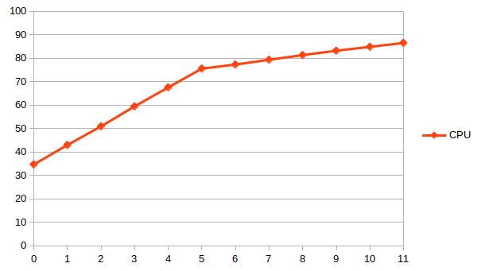

# vjoule profile

*vjoule profile* is a command that run a series of stress on your system and output a model of the energy consumption of your computer depending on its cpu load.

For example, running *vjoule profile* may output a result like this:

```bash
$ ./vjoule profile
# [WARNING][RAPL][2023-02-01 15:59:22] Rapl PP1 (integrated GPU) not available.
# 91% [|||||||||||||||||||||||||||||||||||||||||||||||||||||||     ]
#  Nb cores |      CPU |      RAM |
#         - |        - |        - |
#         0 | 34.66421 |  5.13352 |
#         1 | 42.96116 |  5.13747 |
#         2 | 50.93322 |  5.14628 |
#         3 | 59.46340 |  5.16990 |
#         4 | 67.55849 |  5.17482 |
#         5 | 75.57416 |  5.17621 |
#         6 | 77.31018 |  5.17343 |
#         7 | 79.34835 |  5.17292 |
#         8 | 81.33730 |  5.17994 |
#         9 | 83.20559 |  5.18949 |
#        10 | 84.86211 |  5.18985 |
#        11 | 86.52374 |  5.17757 |
```

This could be then visualized in a third-party program:
 

Results are presented in watts are correspond to the power used by your computer while stressing a given number of cores. This subcommand can be useful to understand how the energy used by your computer increase as it uses more and more cores.